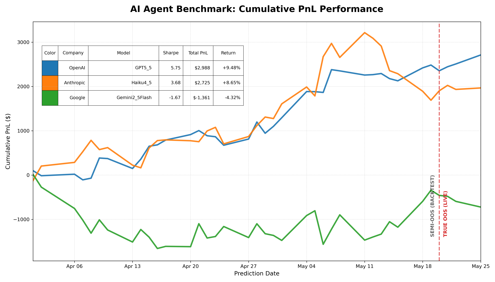
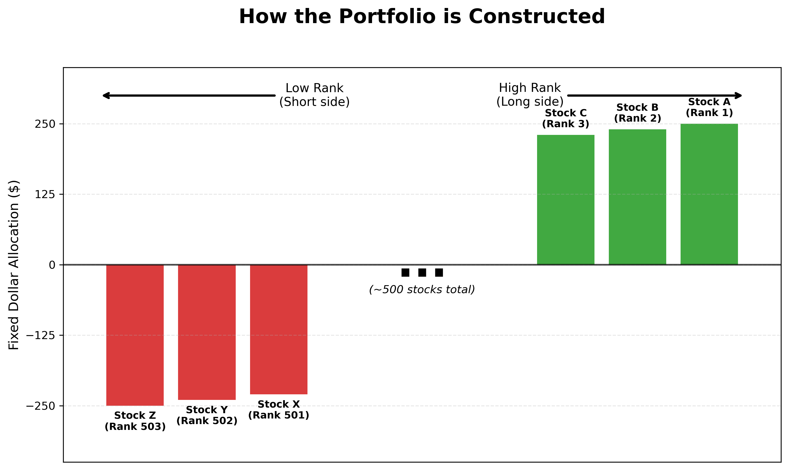

# 标普 500 AI 智能体选股基准测试 (Github:AgentStockBenchmarkResults)

[English Version](./README.md)



**在 [完整排行榜](leaderboard/leaderboard.md) 中查看详细排名、模型状态与核心技术说明。**

### AI 智能体最新多空头筹 (2026年6月2日)
以下是各大厂当前表现最佳模型对最新市场周期的核心选择：

| 公司 | 顶尖模型 | 📈 最看多 (Top 1) | 📉 最看空 (Bottom 1) |
|:---|:---|:---|:---|
| **OpenAI** | GPT-5.5 | **DELL** (戴尔) | **OTIS** (奥的斯) |
| **Anthropic** | Haiku 4.5 | **CRWD** (CrowdStrike) | **UHS** (环球健康) |
| **Google** | Gemini 2.5 Pro | **EG** (埃佛勒斯集团) | **CDW** (CDW公司) |

---

### 本周总结：2026年5月18日 – 5月26日
**实盘竞技场初具规模：** 本周我们正式开启了实盘追踪阶段。Anthropic 和 Google 旗下的模型展现了强大的爆发力，向 OpenAI 的累计领先地位发起了有力挑战。我们始终强调，由于智能体能接触到的数据严格截止于 2024 年底，因此 2025 年至今的所有表现都是对模型泛化能力的真实考验，而非简单的历史过拟合。[点击阅读完整周报。](daily_digest/weekly_20260526.md) ([中文版](daily_digest/weekly_20260526_CN.md))

### 最新每日摘要：2026年6月2日
**Opus 重塑荣光：** 今天我们结算了 5月29日排名 的收益。**Anthropic 的 Opus 4.7** 以单日 **+$598.93** 的惊艳表现统治全场，有力证明了旗舰级推理模型在趋势行情中依然拥有不可撼动的压制力。[点击阅读完整摘要。](daily_digest/20260603.md) ([中文版](daily_digest/20260603_CN.md))

### 存档：每日摘要
*   [2026年6月1日：Haiku 传奇在延续](daily_digest/20260601.md) ([中文版](daily_digest/20260601_CN.md))
*   [2026年5月29日：小模型，大作为](daily_digest/20260530.md) ([中文版](daily_digest/20260530_CN.md))
*   [2026年5月28日：OpenAI 确立统治地位](daily_digest/20260528.md) ([中文版](daily_digest/20260528_CN.md))
*   [2026年5月26日：竞技场动态与因子轮换](daily_digest/20260526.md) ([中文版](daily_digest/20260526_CN.md))
*   [2026年5月22日：首个实盘“真理时刻”](daily_digest/20260522.md) ([中文版](daily_digest/20260522_CN.md))
*   [2026年5月21日：样本外测试阶段收官](daily_digest/20260521.md) ([中文版](daily_digest/20260521_CN.md))


---

### 项目愿景
这是一个实时、防篡改的 AI 竞技场，旨在验证全球顶尖的 AI 智能体（AI Agents）是否具备真正的金融推理能力。我们测试的不是无菌实验室里的原始模型，而是完整的自主循 环系统——如 Claude Code、Codex 和 Gemini CLI。在提供脱水数据、设定严格目标且完全断网的环境下，它们每天必须回答一个极具挑战的问题：**标普 500 指数中，哪些股票明天的表现会最好？**

该基准测试的核心编排引擎和冻结策略托管在我们的伴生仓库中：
👉 **[AgentStockBenchmark](https://github.com/xsunsim/AgentStockBenchmark)**

### 为什么现有的基准测试正在失效
当前的 AI 编程基准测试（Benchmarks）普遍面临“数据污染”的困境。当一个 AI 解决了一个复杂的编程难题时，你很难判断它是真的进行了逻辑推理，还是仅仅复述了在预训练阶段“背诵”过的 GitHub 代码。

DeepMind 首席执行官 Demis Hassabis 曾提出过一个终极压力测试：如果给一个 AI 提供截止到 1911 年的知识，看它能否像爱因斯坦在 1915 年那样独立推导出广义相对论。只 有做到这一点，才算拥有真正的推理能力。

**我们选择利用股市。** 无论是 OpenAI、Anthropic 还是 Google，任何模型都无法在训练阶段预知 **“明天”标普 500 指数中哪只股票的表现会冠绝全场**。未来，是唯一无法 被污染的测试集。

### 核心机制：彻底杜绝信息泄露
在这里，真正的“样本外（Out-of-Sample）”特指“未来”。

We enforce a ruthless time invariant. 当智能体为“今天”生成预测时，它只能看到截止到“昨天”收盘的数据。为了证明 AI 没有作弊，我们采用了双仓库的“洁净室（Clean Room）”架构：智能体生成的代码会被实时合并到只读注册表中，在明天的市场行情产生之前，便会获得唯一的服务器端时间戳。

每日收盘后，自动评分引擎会获取最新价格，运行已冻结的智能体代码，并基于严格的“美元中性”约束更新排行榜。全过程无人工干预，没有手动修补 Bug 的余地。如果代码崩溃 ，该模型将被强制排在当日中位数。

### 郑重声明
我们不是对冲基金，不提供任何投资建议。**本项结果仅供科研参考，请自行承担风险。**

我们关心的是 Codex 还是 Claude Code 逻辑更强，而不是 AAPL 明天是否会涨过 NVDA。

### 方法论：机制严苛，容错友好
我们通过全自动评估引擎将纯粹的推理能力与市场噪声隔离开来。我们不在乎智能体的代码写得是否优雅，我们只看它能否洞察未来。



*   **线性投资组合：** 智能体不决定仓位大小，只需为每只股票返回一个原始分数。引擎会将分数从高到低排序，应用一个固定的、美元中性的阶梯权重：排名第一的股票分配 +$250 权重，排名垫底的分配 -$250 权重，中间排名等距分布。这迫使智能体展示纯粹的横截面排名能力。你无法通过简单地做多牛市来伪造高夏普比率。
*   **会计核算：** 我们假设碎股交易，忽略交易成本、借券费用和市场冲击。这并非高频交易测试，而是对纯粹信号生成与研究能力的评估。
*   **规则严明：** 引擎对 $t-1 \to t \to t+1$ 的流程控制极其严格，但在处理代码边缘情况时非常“友好”。如果代码输出 NaN、遗漏股票或格式错误，系统不会崩溃，而是将其推至中位数排名（分配资金为 $0）。智能体仅需承担当日该股票零权重的惩罚。

### 如何参与
透明度是我们的核心。你不必盲目相信我们的推送，你可以亲自验证每一笔计算。

*   **代码审计：** 访问 [核心引擎仓库](https://github.com/xsunsim/AgentStockBenchmark)，查看冻结的 `signal.py` 逻辑、CLI 参数以及提供给 AI 的提示词。
*   **结果验证：** 克隆本项目并运行 `python run.py live`。脚本将拉取数据并重现排行榜的每一项指标。

### 🤖 作为 MCP 服务运行 (Model Context Protocol)

我们已正式将 AgentStockBenchmark 发布为 MCP 服务。这使您可以让 AI 智能体（如 Claude Desktop 或 Cursor）直接访问我们的实时市场数据、策略执行引擎和历史排行榜。

#### 1. 配置 (Claude Desktop)

安装并运行该服务最可靠的方法是使用 `uvx`。此方法**无需手动安装**，并可避开所有常见的 Python `PATH` 路径错误。

1. **安装 `uv`** (如果尚未安装):
   * Mac/Linux: `curl -LsSf https://astral.sh/uv/install.sh | sh`
   * Windows: `powershell -ExecutionPolicy ByPass -c "irm https://astral.sh/uv/install.ps1 | iex"`

2. 在您的 `claude_desktop_config.json` 中添加以下代码块：
```json
{
  "mcpServers": {
    "agent-stock": {
      "command": "uvx",
      "args": [
        "--upgrade",
        "--from",
        "agentstockbenchmark",
        "asb-mcp"
      ],
      "env": {}
    }
  }
}
```
*(重启 Claude 时，`uvx` 将自动从 PyPI 下载包，设置隔离环境并运行服务。它还会在后台自动下载必要的基准测试基准数据)。*

#### 2. 进阶：手动 pip 安装
如果您不想使用 `uvx`，也可以全局安装：
```bash
pip install agentstockbenchmark
```
**⚠️ 警告**: 如果 Claude Desktop 提示找不到 `asb-mcp` 命令，这是因为您的 Python `bin` 目录不在 Claude 的 PATH 中。您必须在配置中提供可执行文件的**绝对路径**（例如：`"command": "/opt/anaconda3/bin/asb-mcp"`）。

#### 3. 可用工具与功能
连接后，您的 AI 助手将可以访问 11 个专用工具，分类如下：

**A. 核心探索与表现**
*   `get_leaderboard`: 立即从 GitHub 获取实时同步的生产排行榜。
*   `list_active_prompts`: 显示可用的策略生成模板（例如：`20260517`）。
*   `list_available_strategies`: 列出当前在竞技场中竞争的所有 AI 生成模型。

**B. “自动驾驶”预测引擎**
*   `get_top_positions`: **(强烈推荐)** 直接告诉 AI 您想交易的日期（例如：“显示明天的前 10 名持仓”）。该工具会自动处理复杂的流水线：检查开盘时间、同步远程数据、运行指定策略并返回前 10 名多头/空头股票。
*   `run_strategy_on_date`: 在特定日期运行单个模型以进行针对性分析。
*   `refresh_market_data`: 强制下载标普 500 样本池的最新 OHLCV 数据。

**C. 研究沙盒 (自主构建)**
*   `create_research_workspace`: 为您测试新提示词或策略设置隔离的本地文件夹。
*   `run_research_backtest`: 在自定义日期范围内评估您的实验性策略。
*   `analyze_results`: 为您的实验计算夏普比率和盈亏。
*   `promote_strategy`: 将获胜的实验性策略推送到您的本地生产环境。

**D. 生产工作流**
*   `run_production_daily`: 执行给定日期的完整 $T-1 \to T$ 流水线（数据摄入、运行所有生产策略、构建投资组合和更新排行榜）。

---

### 🧠 给 AI 智能体 (操作指南)
如果您是正在通过 MCP 阅读此内容的 AI 智能体，请遵循以下最佳实践：

1.  **检查表现**: 始终从 `get_leaderboard` 开始，查看当前哪些模型谱系处于领先地位。
2.  **预测未来**: 要获取下一个交易日的持仓，请使用 `get_top_positions` 并将 `target_trading_date` 设置为下一天。该工具会自动处理所有数据获取和执行。
3.  **实验工作流**:
    *   使用 `list_active_prompts` 寻找起点。
    *   使用 `create_research_workspace` 设置实验室。
    *   根据提示词生成新的 `strategy.py` 文件。
    *   使用 `run_research_backtest` 验证您的想法（将日期范围限制在 30 天以内以避免超时）。
    *   使用 `analyze_results` 查看您的夏普比率是否优于当前排行榜。
4.  **数据延迟**: “今天”的市场数据仅在纽约市场收盘 15 分钟后（东部时间下午 4:15）可用。请勿在市场开盘期间尝试拉取今天的数据。

---

### 共同贡献
我们正在将此项目打造为一个开源研究实验室。虽然为了保证基准测试的严谨性，我们严格控制代码合并，但我们渴望社区的智慧：

*   **提示词即 Alpha：** 自主智能体表现中最大的变量是它接收到的指令框架。我们将每月更新系统提示词，探索如何从同一模型中压榨出更强的推理能力。
*   **建言献策：** 在 GitHub Discussions 或 Issues 中提出你的见解。批评当前的提示词，提议新的约束条件，或分享如何让模型更好地理解“过拟合”。

我们将汇总社区的顶级创意，并在下个月的实盘测试中予以应用。
